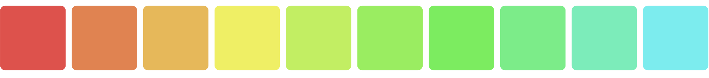
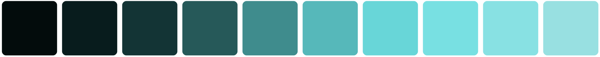

# Tailwind Colorize 

[click here](./test.txt)




🟥 🟧 🟨 🟩 🟦 

*The fluent and expressive way to manipulate colors in Tailwind CSS.*

I ❤️ Tailwind. But one thing I loathe is when I have to create new colors and color variations, resulting in leaving the code I am writing. It usually starts by opening some color app, picking the color, adjusting the hue or shade in some minute way, editing the config to save the color, and repeating this totally arbitrary process until it "feels" correct. 

I want to be able to manipulate colors syntaxically in a same way we already use colors in Tailwind, but with optional opt-in enhancements.

## Table of Contents

- [Tailwind Colorize](#tailwind-colorize)
  - [Table of Contents](#table-of-contents)
  - [Project Spec](#project-spec)
    - [A Little Background](#a-little-background)
  - [Installation](#installation)
      - [NPM](#npm)
      - [Yarn](#yarn)
      - [PostCSS](#postcss)
      - [Tailwind](#tailwind)
    - [Arbitrary Color Values](#arbitrary-color-values)
    - [Arbitrary Values using CSS](#arbitrary-values-using-css)
  - [Available Methods](#available-methods)
    - [Lighten](#lighten)
    - [Darken](#darken)
    - [Lightness](#lightness)
    - [Whiten](#whiten)
    - [Blacken](#blacken)
    - [Fade](#fade)
    - [Saturate](#saturate)
    - [Desaturate](#desaturate)
    - [Rotate](#rotate)
    - [Grayscale](#grayscale)
    - [Mix](#mix)
    - [Negate](#negate)
  - [PEG Parser](#peg-parser)
    - [A note about whitespace... 🐍](#a-note-about-whitespace-)
  - [Color Syntax](#color-syntax)
  - [Method Chaining](#method-chaining)

## Project Spec

- Expressive, fluent, and chainable syntax that is easy to read and remember.
- Flexible and customizable to work for as many situations as possible.
- Must support all Tailwind colors and CSS colors, such as `hex`, `hsl`, and `rgb`.
- Make use of [color](https://www.npmjs.com/package/color) to manipulate the actual colors.
- Make use of [peggy](https://peggyjs.org/) to parse the expressions.
- Must work with Tailwind Intellisense.
- Stability. No breaking changes whenever possible.
- Unit test coverage with Jest.

### A Little Background 

I built this plugin because I found myself running out of colors, or not having enough subtlety between the color variations, especially when adding dark mode support to applications. The tonal difference between `slate` and `zinc` is the difference between `blue` and `brown` when it comes to consistently gradiated applications. In addition, the difference between `800` and `900` on any of on the standard colors is pretty large.

Let's take a button which has the attribute `class="rounded p-2 bg-blue-500 hover:bg-blue-600 active:bg-blue-700"`. Three different colors to represent each state, but difference between the active state and hover state are a bit too stark for my taste. What I really want is the ability to do something like `bg-blue-650` or `bg-blue-625` without having to take time to figure what those values would be for each instance. And I especially don't want to use a color picker application of any kind, but rather have consistent mathematical derivitives of the colors inline with those defined in the theme.

Let me introduce you to Tailwind Colorize...

## Installation

#### NPM
```bash
npm i tailwind-colorize-plugin
```

#### Yarn
```bash
yarn add tailwind-colorize-plugin
```

#### PostCSS

To install the plugin, you must be sure to require `tailwind-colorize-plugin` inside the `postcss.config.js` after Tailwind CSS.

```js
// postcss.config.js
const colorize = require('tailwind-colorize-plugin');

module.exports = {
    plugins: [
        require('tailwindcss'),
        require('tailwind-colorize-plugin'),
        require('autoprefixer')
    ]
}
```

#### Tailwind

Tailwind Colorize ships with a Tailwind CSS plugin to make all the default colors available in intervals of 10 instead of just 100. This plugin is optional, but it super useful and the colors will automatically render in VSCode intellesense.

```js
// tailwind.config.js
const colors = require('tailwind-colorize-plugin/extra-colors');

module.exports = {
    plugins: [
        colors();
    ]
}
```

## Getting Started

Your theme colors are one of the defining characteristics of your app. However, there are times you may just want to make slight adjustments, like wanting `slate.850` or `slate.825` without having to figure out what that value is. Or even, a blend of two color.

Tailwind Colorize doesn't take much to get start. It will parse your theme automatically. Not worry, anything that you have defined will stay the same unless it is a valid "colorized" syntax, in which is it be parsed and the returned color will be used. All the core Tailwind plugins are supported out of the box.

*Tip, if you want custom plugins to take advanvantage of Colorize, then be sure to include `colorize()` at the top of the `plugins: []` in the `tailwind.config.js` config file.*

```js
/** @type {import('tailwindcss').Config} */
module.exports = {
  content: [
    './index.html'
  ],
  theme: {
    extend: {
      colors: {
        'water': {
          'lighter': 'sky.500.lighten(.50)',
          'light': 'sky.500.lighten(.25)',
          DEFAULT: 'sky.500',
          'dark': 'sky.500.darken(.25)',
          'darker': 'sky.500.darken(.50)',
        }
      }
    },
  }
}
```

```html
<div class="bg-water-lighter w-24 h-24 rounded-lg"></div>
<div class="bg-water-light w-24 h-24 rounded-lg"></div>
<div class="bg-water w-24 h-24 rounded-lg"></div>
<div class="bg-water-dark w-24 h-24 rounded-lg"></div>
<div class="bg-water-darker w-24 h-24 rounded-lg"></div>
```


### Arbitrary Color Values


```html
<div class="bgx-[[red.500.mix(yellow.100,.1)]] w-24 h-24 rounded-lg"></div>
<div class="bgx-[red.500.mix(yellow.100,.2)] w-24 h-24 rounded-lg"></div>
<div class="bgx-[red.500.mix(yellow.100,.3)] w-24 h-24 rounded-lg"></div>
<div class="bgx-[red.500.mix(yellow.100,.4)] w-24 h-24 rounded-lg"></div>
<div class="bgx-[red.500.mix(yellow.100,.5)] w-24 h-24 rounded-lg"></div>
<div class="bgx-[red.500.mix(yellow.100,.6)] w-24 h-24 rounded-lg"></div>
<div class="bgx-[red.500.mix(yellow.100,.7)] w-24 h-24 rounded-lg"></div>
<div class="bgx-[red.500.mix(yellow.100,.8)] w-24 h-24 rounded-lg"></div>
<div class="bgx-[red.500.mix(yellow.100,.9)] w-24 h-24 rounded-lg"></div>
<div class="bgx-[red.500.mix(yellow.100,1)] w-24 h-24 rounded-lg"></div>
```


### Arbitrary Values using CSS

And you can use the same syntax if you want to define styles inside your CSS manually.

```css
.bg-water {
    @apply bgx-[sky.500.whiten(.1)]
}
```

## Available Methods

This plugin uses [color](https://www.npmjs.com/package/color) under the hood to process the actual color manipulations. The parser will analyze the syntax and expose a API that should feel very similar to the JS.

### Lighten

```ts
lighten(value: number)
```

**Example**

```js
colors: {
    reddish: {
        DEFAULT: 'red.500.lighten(0)',
        100: 'red.500.lighten(.1)',
        200: 'red.500.lighten(.2)',
        300: 'red.500.lighten(.3)',
        400: 'red.500.lighten(.4)',
        500: 'red.500.lighten(.5)',
        600: 'red.500.lighten(.6)',
        700: 'red.500.lighten(.7)',
        800: 'red.500.lighten(.8)',
        900: 'red.500.lighten(.9)',
    }
}
```


---

### Darken

```ts
darken(value: number)
```

**Example**

```js
colors: {
    reddish: {
        DEFAULT: 'red.500.darken(0)',
        100: 'red.500.darken(.1)',
        200: 'red.500.darken(.2)',
        300: 'red.500.darken(.3)',
        400: 'red.500.darken(.4)',
        500: 'red.500.darken(.5)',
        600: 'red.500.darken(.6)',
        700: 'red.500.darken(.7)',
        800: 'red.500.darken(.8)',
        900: 'red.500.darken(.9)',
    }
}
```


---

### Lightness

```ts
lightness(value: number)
```

**Example**

```js
colors: {
    reddish: {
        DEFAULT: 'red.500.darken(0)',
        100: 'red.500.lightness(10)',
        200: 'red.500.lightness(20)',
        300: 'red.500.lightness(30)',
        400: 'red.500.lightness(40)',
        500: 'red.500.lightness(50)',
        600: 'red.500.lightness(60)',
        700: 'red.500.lightness(70)',
        800: 'red.500.lightness(80)',
        900: 'red.500.lightness(90)',
    }
}
```


---

### Whiten

```ts
whiten(value: number)
```

**Example**

```js
colors: {
    reddish: {
        DEFAULT: 'red.500.whiten(0)',
        100: 'red.500.whiten(.1)',
        200: 'red.500.whiten(.2)',
        300: 'red.500.whiten(.3)',
        400: 'red.500.whiten(.4)',
        500: 'red.500.whiten(.5)',
        600: 'red.500.whiten(.6)',
        700: 'red.500.whiten(.7)',
        800: 'red.500.whiten(.8)',
        900: 'red.500.whiten(.9)',
    }
}
```


---

### Blacken

```ts
blacken(value: number)
```

**Example**

```js
colors: {
    reddish: {
        DEFAULT: 'red.500.blacken(0)',
        100: 'red.500.blacken(.1)',
        200: 'red.500.blacken(.2)',
        300: 'red.500.blacken(.3)',
        400: 'red.500.blacken(.4)',
        500: 'red.500.blacken(.5)',
        600: 'red.500.blacken(.6)',
        700: 'red.500.blacken(.7)',
        800: 'red.500.blacken(.8)',
        900: 'red.500.blacken(.9)',
    }
}
```


### Fade

```ts
fade(value: number)
```

**Example**

```js
colors: {
    reddish: {
        DEFAULT: 'red.500.fade(0)',
        100: 'red.500.fade(.1)',
        200: 'red.500.fade(.2)',
        300: 'red.500.fade(.3)',
        400: 'red.500.fade(.4)',
        500: 'red.500.fade(.5)',
        600: 'red.500.fade(.6)',
        700: 'red.500.fade(.7)',
        800: 'red.500.fade(.8)',
        900: 'red.500.fade(.9)',
    }
}
```


---

### Saturate

```ts
Saturate(value: number)
```

**Example**

```js
colors: {
    reddish: {
        DEFAULT: 'red.500.saturate(0)',
        100: 'red.500.saturate(.1)',
        200: 'red.500.saturate(.2)',
        300: 'red.500.saturate(.3)',
        400: 'red.500.saturate(.4)',
        500: 'red.500.saturate(.5)',
        600: 'red.500.saturate(.6)',
        700: 'red.500.saturate(.7)',
        800: 'red.500.saturate(.8)',
        900: 'red.500.saturate(.9)',
    }
}
```


---

### Desaturate

```ts
desaturate(value: number)
```

**Example**

```js
colors: {
    reddish: {
        DEFAULT: 'red.500.desaturate(0)',
        100: 'red.500.desaturate(.1)',
        200: 'red.500.desaturate(.2)',
        300: 'red.500.desaturate(.3)',
        400: 'red.500.desaturate(.4)',
        500: 'red.500.desaturate(.5)',
        600: 'red.500.desaturate(.6)',
        700: 'red.500.desaturate(.7)',
        800: 'red.500.desaturate(.8)',
        900: 'red.500.desaturate(.9)',
    }
}
```


---

### Rotate

```ts
rotate(value: number)
```

**Example**

```js
colors: {
    reddish: {
        DEFAULT: 'red.500.rotate(0)',
        20: 'red.500.rotate(20)',
        40: 'red.500.rotate(40)',
        60: 'red.500.rotate(60)',
        80: 'red.500.rotate(80)',
        100: 'red.500.rotate(100)',
        120: 'red.500.rotate(120)',
        140: 'red.500.rotate(140)',
        160: 'red.500.rotate(160)',
        180: 'red.500.rotate(180)'
    }
}
```


---

### Grayscale

```ts
grayscale(value: number)
```

**Example**

```js
colors: {
    reddish: {
        DEFAULT: 'red.500.grayscale(0)',
        100: 'red.500.grayscale(20)',
        200: 'red.500.grayscale(40)',
        300: 'red.500.grayscale(60)',
        400: 'red.500.grayscale(80)',
        500: 'red.500.grayscale(100)',
        600: 'red.500.grayscale(120)',
        700: 'red.500.grayscale(140)',
        800: 'red.500.grayscale(160)',
        900: 'red.500.grayscale(180)'
    }
}
```


---

### Mix

```ts
mix(color: Color, value?: number)
```

**Example**

```js
colors: {
    reddish: {
        100: 'red.500.mix(yellow.100,.1)',
        200: 'red.500.mix(yellow.100,.2)',
        300: 'red.500.mix(yellow.100,.3)',
        400: 'red.500.mix(yellow.100,.4)',
        500: 'red.500.mix(yellow.100,.5)',
        600: 'red.500.mix(yellow.100,.6)',
        700: 'red.500.mix(yellow.100,.7)',
        800: 'red.500.mix(yellow.100,.8)',
        900: 'red.500.mix(yellow.100,.9)',
        DEFAULT: 'red.500.mix(yellow.100,1)'
    }
}
```


---

### Negate

```ts
negate()
```

**Example**

```js
colors: {
    reddish: {
        50: 'red.50.negate(0)',
        100: 'red.500.negate()',
        200: 'red.500.negate()',
        300: 'red.500.negate()',
        400: 'red.500.negate()',
        500: 'red.500.negate()',
        600: 'red.500.negate()',
        700: 'red.500.negate()',
        800: 'red.500.negate()',
        900: 'red.500.negate()'
    }
}
```




## PEG Parser

A PEG parser is used to analyze and tokenize the expression in real time. The parser is incredibly fast and efficient. 

An expression must start with a color and may include methods chained together that will return a new `Color` instance. A color must be in the following format: theme color (without or without a weight), CSS color name, `hex`, `rgb`, or `hsl`. For a more detailed description of the grammar, you may wish to refer to the definition file `grammar.pegjs`.

### A note about whitespace... 🐍

Much like Python, whitespace is not ignored by the grammar. This is intentional. Due to the way CSS and Tailwind attributes are parsed, the syntax is intentionally sensitive to whitespace. It may be possible this limitation can be removed in the future, but for now whitespace will trigger a parsing error.

**Valid** \
`red.500.fade(.5).mix(purple.500,.25)`

**Invalid** \
`red.500.fade(.5).mix(purple.500, .25)`

## Color Syntax

Colors are defined by using their name as a literal, following by an optional weight, if its a theme color that has weights defined. The following are valid color example of how one would begin an expression.

```js
// Theme Colors
red.500
slate.900
yellow.200
white

// CSS Color Names
cornsilk
bisque
coral

// Color Functions
rgb(225,0,0)
hsl(0,84.2%,60.2%)

// Hex Codes
#eee
#e0e0e0
```

## Method Chaining

Methods arguments are recursive. Each method must return a new instance of `Color`, so each method in the chain modifies a new instance until it reaches the end of the line.

```js
// Theme Colors
red.500.darken(.1)
red.500.darken(.1).mix(yellow.200.darken(.1),.5)

// CSS Color Names
coral.darken(.1)
coral.darken(.1).mix(bisque.darken(.1),.5)

// Hex Codes
#eee.darken(.1)
#e0e0e0.darken(.1).green(100).mix(#eee.red(100),.5)
```
